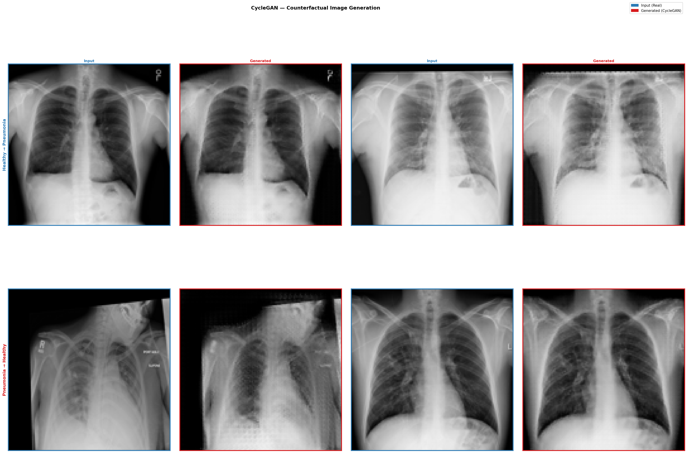

## Experiments, Results, and Discussion of Results

### 1. CycleGAN Method Description

CycleGAN (Cycle-Consistent Generative Adversarial Network) is an unpaired image-to-image translation framework introduced by Zhu et al. (2017). It learns bidirectional mappings between two image domains without requiring paired training examples. In this project, **healthy chest X-rays** (domain H) and **pneumonia chest X-rays** (domain P). 

The framework comprises four networks trained simultaneously:

- **G_H2P**: Generator that translates Healthy → Pneumonia  
- **G_P2H**: Generator that translates Pneumonia → Healthy  
- **D_H**: Discriminator for the Healthy domain  
- **D_P**: Discriminator for the Pneumonia domain  

The total generator loss combines three components:

$$
\mathcal{L}_G = \mathcal{L}_{\text{GAN}} + \lambda_{\text{cycle}} \cdot \mathcal{L}_{\text{cycle}} + \lambda_{\text{identity}} \cdot \mathcal{L}_{\text{identity}}
$$

- **GAN loss** (LSGAN / MSE-based): encourages generators to produce images indistinguishable from the target domain.  
- **Cycle consistency loss** (L1): enforces that translating an image to the other domain and back recovers the original — $G_{P2H}(G_{H2P}(x_H)) \approx x_H$ and vice versa. This is the key constraint that preserves anatomical structure.  
- **Identity loss** (L1): regularizes each generator when fed images already in the target domain, helping preserve color and texture properties.

Each discriminator uses a **70×70 PatchGAN** architecture, which classifies overlapping image patches as real or fake rather than the whole image, encouraging high-frequency sharpness.

---

### 3. Training Configuration

| Hyperparameter | Value |
|---|---|
| Image size | 128 × 128 |
| Batch size | 4 |
| Epochs | 200 |
| Learning rate | 2 × 10⁻⁴ |
| Optimizer | Adam (β₁ = 0.5, β₂ = 0.999) |
| λ_cycle | 10.0 |
| λ_identity | 5.0 |
| Generator residual blocks | 6 |
| Image replay buffer size | 50 |
| Device | CUDA |

**Generator architecture** — ResNet-based encoder-decoder:
1. Initial 7×7 convolution → 64 feature maps  
2. Two strided downsampling convolutions (64 → 128 → 256)  
3. Six residual blocks at 256 channels  
4. Two transposed convolutions for upsampling (256 → 128 → 64)  
5. Final 7×7 convolution + Tanh output  
All intermediate layers use InstanceNorm2d.

**Discriminator architecture** — 70×70 PatchGAN: four convolutional layers (C64 → C128 → C256 → C512) with LeakyReLU (slope 0.2) and InstanceNorm2d, followed by a single-channel output map.

**Training data augmentation** (train split only):
- Random horizontal flip (p = 0.5)  
- Random rotation (±5°)  
- Random affine: translation ±2%, scale 0.98–1.02  
- Pixel normalization: mean = 0.5, std = 0.5 (mapping to [−1, 1])  

**Discriminator stabilization**: a replay buffer of size 50 was used for both fake-healthy and fake-pneumonia images, following the original CycleGAN paper. Discriminator loss was scaled by 0.5.

**Validation**: at the end of each epoch, the cycle consistency loss is evaluated on the validation set using both generators in evaluation mode.

---

### 4. Training

#### Baseline CycleGAN (128 × 128, 6 residual blocks)

The training run used the configuration described above as a baseline. The main goals were to:

1. Verify training stability (no mode collapse or vanishing gradients in generator/discriminator losses)  
2. Qualitatively inspect whether the generated images are visually coherent chest X-rays  
3. Assess cycle consistency (whether the reconstructed images recover the input)  

Loss curves (generator total loss, discriminator losses, cycle loss, identity loss, and validation cycle loss) were tracked across all 200 epochs and saved as `outputs/losses/loss_curve.png`. Side-by-side grids of real, translated, and reconstructed images were saved every epoch to `outputs/progress/`.

---

### 5. Results

#### 5.1 Training Loss Behavior

Training ran for 200 epochs on the NIH Chest X-ray training split. All losses are plotted on a logarithmic scale.

The **generator total loss (G_loss)** started high (~5) and decreased steeply during the first ~50 epochs, then continued to decrease slowly, stabilizing around 2.0–2.3 by the end of training, with no signs of mode collapse. The **cycle consistency loss** dropped sharply from ~4 in the first 30 epochs down to approximately 0.8–1.0 by epoch 200, indicating that the generators progressively learned to preserve the anatomical structure of the input image after the round-trip translation. The **identity loss** decreased from ~0.8 to ~0.4, confirming that each generator applies minimal unnecessary changes when given an image already in its target domain. The **discriminator losses (D_H, D_P)** both stabilized around 0.15–0.20 throughout training, indicating that the discriminators remained consistently capable of distinguishing real from generated images. The **validation cycle loss** is noisy due to the small validation set, but closely tracks the training cycle loss, suggesting no overfitting to the training domain.

The most notable behavior is the monotonic upward trend of the GAN loss throughout training. Tha GAN loss is the average of `MSELoss(D_P(G_H2P(real_healthy)), 1)` and `MSELoss(D_H(G_P2H(real_pneumonia)), 1)`. Each term measures how far the discriminator's score on a fake image is from 1. For this loss to increase, the discriminators must be scoring fake images progressively lower — meaning they are getting better at detecting generated images over time, and the generators are not catching up.

The total generator loss is composed of the GAN term (unscaled, weight 1), the cycle consistency term (scaled by λ_cycle = 10), and the identity term (scaled by λ_identity = 5). In the early epochs, the cycle and identity terms are large and dominate the generator gradient by roughly 8×, so the generators invest almost all of their capacity in learning structural consistency. The discriminators, optimized in a completely separate step, improve undisturbed throughout this period. By the time cycle and identity losses shrink enough for the GAN gradient to matter proportionally, the discriminators have already built a persistent advantage that the generators never fully recover from. In a healthy adversarial training regime, the GAN loss should oscillate around a roughly stable value as generators and discriminators alternate between gaining and losing the upper hand. For future tests, a different set of parameters will be conducted to check if this pattern changes.

#### 5.2 Visual Quality of Generated Images

**Counterfactual image generation examples**

The figure above shows 4 example pairs for each translation direction, randomly sampled from the test set. Blue borders denote real (input) images; red borders denote generated (output) images.

The generated images maintain the overall chest structure (rib cage, cardiac silhouette, diaphragm position) while introducing subtle changes for both of the translations. Overall, the generation was performed successfully at 128 × 128 resolution. The generated images are visually coherent chest X-rays, though some cases show minor artifacts around the lung borders.

---

**Counterfactual change heatmaps**

The heatmaps visualize the absolute per-pixel difference between the real and generated images, overlaid on the real image to preserve anatomical context. Brighter colors indicate larger pixel-level changes.

The change heatmaps confirm that the model is not modifying images uniformly. This spatial specificity is an encouraging sign for the counterfactual explainability goal. The model appears to be encoding a representation of the disease rather than introducing arbitrary global texture changes.

However, some heatmap cases show activity near the image borders and outside the lung fields, suggesting the model occasionally makes spurious peripheral changes. This may be a consequence of the small training set size or the 128 × 128 resolution limiting fine spatial encoding.

#### 5.3 Quantitative Evaluation

The primary quantitative metric for generation quality is the **Fréchet Inception Distance (FID)**, computed between:

- Real pneumonia images vs. generated pneumonia images (G_H2P applied to the healthy test set)  
- Real healthy images vs. generated healthy images (G_P2H applied to the pneumonia test set)  

Lower FID indicates that the generated distribution is closer to the real distribution.

FID was evaluated on the test set using the checkpoint from epoch 199:

| Translation | Test images | FID |
|---|---|---|
| Healthy → Pneumonia (G_H2P) | 71 healthy images | 121.09 |
| Pneumonia → Healthy (G_P2H) | 33 pneumonia images | 109.58 |
| **Mean FID** | — | **115.34** |

The FID scores are moderately high. Out test dataset is small, with only 33 pneumonia cases, which can be interfering the metric. The slightly better FID for the P→H direction may reflect that the healthy domain is larger and more varied, providing a richer target distribution. These scores serve as a baseline for comparison in future experiments.

---

### 6. Discussion

#### Observations

The choice of CycleGAN as the translation backbone was motivated by its ability to train on **unpaired data**, which is a realistic constraint in clinical settings where matched healthy/pneumonia images from the same patient are rarely available. The cycle consistency constraint is particularly well-suited to the counterfactual generation goal since it enforces that only disease-relevant features are modified, while preserving the underlying anatomy of the patient.

The use of a **128 × 128** resolution was a deliberate trade-off between image fidelity and computational cost. Chest X-rays at this resolution retain coarse pathological patterns (opacification, consolidation) while keeping training feasible.

The **identity loss** was included to avoid unnecessary texture shifts when a generator receives an image already in its target domain, which is especially important for grayscale medical images where contrast changes could be mistaken for pathology.

#### Limitations and Potential Directions

- **Resolution**: 128 × 128 may be insufficient to capture fine-grained radiological features such as subtle consolidation boundaries. A follow-up experiment at 256 × 256 is planned if computational resources allow.
- **Class imbalance**: We still have much more cases of healthy X-ray than Pneumonia, which might be affecting the performance of the generator, specially to learn H->P translaction. The unpaired setup partially mitigates this, but a more balanced set would strengthen the evaluation.
- **FID as sole metric**: FID measures distributional similarity but not clinical relevance. Future work will complement it with a classifier-based counterfactual validity check — generated pneumonia images should flip a downstream classifier's prediction with high probability.
- **Artifact reduction**: minor artifacts observed at lung borders in some generated images warrant investigation into whether longer training, higher resolution, or spectral normalization in the discriminator could reduce them.

